<!-- Social Section --> 
 
 
   <i>Take a look at my repositories and let's get in touch!</i> 
 
 
 
    
    
  
  <!--a href= "https://twitter.com/stn1slv"> 
      
   </a-->

    
     
   
   
   
 
 
 

<!-- GitHub Stats -->
<picture>
<source srcset="https://raw.githubusercontent.com/stn1slv/stn1slv/main/img/github-stats-dark.svg" media="(prefers-color-scheme: dark)" width="400"/>
<source srcset="https://raw.githubusercontent.com/stn1slv/stn1slv/main/img/github-stats-light.svg" media="(prefers-color-scheme: light), (prefers-color-scheme: no-preference)" width="400"/>

</picture> 

<!-- GitHub Streak Stats -->
<!--picture>
<source  srcset="https://raw.githubusercontent.com/stn1slv/stn1slv/main/img/streak-stats-dark.svg" media="(prefers-color-scheme: dark)" width="400"/>
<source srcset="https://raw.githubusercontent.com/stn1slv/stn1slv/main/img/streak-stats-light.svg" media="(prefers-color-scheme: light), (prefers-color-scheme: no-preference)" width="400"/>

</picture><br/-->

<!-- GitHub Contributor -->
<picture>
<source  srcset="https://raw.githubusercontent.com/stn1slv/stn1slv/main/img/github-contributor-dark.svg" media="(prefers-color-scheme: dark)" width="400"/>
<source srcset="https://raw.githubusercontent.com/stn1slv/stn1slv/main/img/github-contributor-light.svg" media="(prefers-color-scheme: light), (prefers-color-scheme: no-preference)" width="400"/>

</picture> 

<!-- Most used languages -->
<picture>
<source  srcset="https://raw.githubusercontent.com/stn1slv/stn1slv/main/img/top-langs-dark.svg" media="(prefers-color-scheme: dark)" width="400"/>
<source srcset="https://raw.githubusercontent.com/stn1slv/stn1slv/main/img/top-langs-light.svg" media="(prefers-color-scheme: light), (prefers-color-scheme: no-preference)" width="400"/>

</picture>

<!-- GitHub Trophy-->
<!--img src="https://github-profile-trophy.vercel.app/?username=stn1slv&row=2&column=3&no-bg=true&theme=darkhub&no-frame=true" alt="stn1slv"/-->
 

