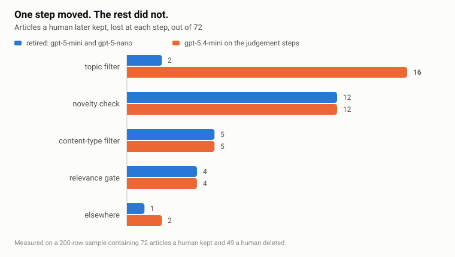
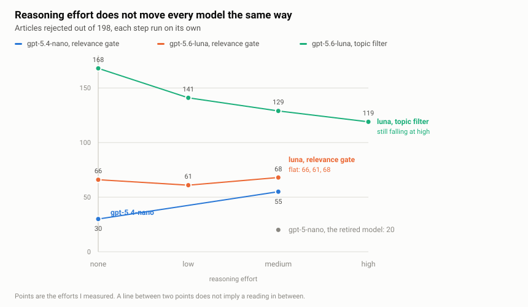

# Migrating off gpt-5: the models were fine, my measurements were not

I expected to move an LLM pipeline off the gpt-5 family in minutes. Change the model names in the configuration, run the tests, done. It took most of a weekend, and almost all of that went into discovering that my measurements were worse than either model.

OpenAI is retiring gpt-5, gpt-5-mini, gpt-5-nano and gpt-5-pro on 11 December 2026. My pipeline ran on the two small ones, so the migration was not optional. I evaluated the gpt-5.4 family and gpt-5.6-luna as replacements.

## The setup

The pipeline takes in around 2,600 articles a month and cuts them to roughly 120 candidates that a person then reviews by hand. That cut is not one model call. It runs on a private agent of mine built on LangGraph, about a dozen steps in the graph, ten of them separate model calls. Three of those steps matter for this article: a relevance gate at the front, a content-type filter and a topic filter, with a novelty check, scoring and summarisation behind them.

One structural detail drives everything below. The first step is a noise filter, not a quality judge, and its two kinds of mistake cost completely different amounts. Something wrongly kept gets caught later, by a stronger model or by the person doing the final review. Something wrongly dropped is gone for good, because the article is recorded as seen and never comes back.

## Where I landed

Nine of the ten model calls now run gpt-5.6-luna, which has held up well. The relevance gate at the very front stays on gpt-5.4-nano, for reasons that took most of the weekend to establish. Every call also has its reasoning effort set explicitly rather than left to the model's default, which turned out to matter more than the model names did.

Cost decided the shortlist before quality entered the conversation, but not through the rate card. Almost all of my traffic bills under OpenAI's data-sharing programme, and luna shares its larger daily allowance with the cheapest models I had, so the bill is a few cents a month either way. The stronger models in the same generation sit in an allowance I would exhaust before lunch, which took them off the list.

Four things surprised me. They are in the order I learned them, which is also the order I would check them.

## 1. My baseline was the thing I was trying to replace

I scored each replacement configuration by how closely it reproduced the previous model's output. That produced an alarming 31-article regression and sent me hunting a model defect that did not exist.

The flaw is easy to see afterwards. The pipeline's first pass produces candidates, and 40 to 60 percent of them get deleted later by a human. Scoring a new configuration against the old one's output measures agreement with a filter I already knew was mediocre. It rewards reproducing its mistakes.

Better ground truth was sitting in version control the whole time. The final human review deletes items from the candidate list, and that deletion is a commit. For the test month the first pass of it took 122 candidates down to 72, and later passes cut further. Comparing that commit with its parent gives two labelled sets: the articles a human kept, and the articles a human threw away.

Re-scored against those, 43 percent of the 31 turned out to be articles the human had deleted anyway. Against the human labels the real loss was 15 good articles, half the size of the regression I had been chasing. More usefully, the same labels say which step lost each one. The chart below measures the gpt-5.4-mini configuration rather than the luna one I shipped, because I stopped the luna run early, and it counts articles a human later kept:

One step moved and nothing else shifted by more than a single article. That is a much better thing to own than a 31-article mystery.

If any part of your system ends in a human decision, that decision is your ground truth, and it is usually already recorded somewhere: approval queues, moderation overrides, ticket reclassifications, edits to generated drafts. Measuring the steps separately also finds bugs that have nothing to do with the migration. It is how I learned that my novelty check invents topic names that appear nowhere in the list it is given, a different one for each of its 24 rejections, under old and new models alike.

## 2. The new model was enforcing rules the old one ignored

With the loss traced to the topic filter, the reflex was to retune that prompt for the new model. That would have been actively harmful, because a later and stronger stage reads the same prompt files. Loosening a rule to suit a first-stage model degrades the stage doing the real judging, and no first-stage test would show it.

So instead of editing, I asked the model to explain itself. I captured gpt-5.4-mini's stated reason for every article the topic filter dropped, about twenty calls.

The reasons were coherent. They cited rules by name and quoted the prompt accurately. One reproduced almost word for word a rule excluding AI cost optimisation "even when implemented at an API gateway", while rejecting an article a human had kept.

gpt-5-mini had simply been ignoring that rule. Two of the rules it ignored were genuinely stale: one had no exception for messaging patterns implemented inside an application, and one predated AI gateways existing as infrastructure worth including. I fixed those two, left the rest alone, and put the fix in its own commit, apart from the model change, so the two could be measured separately.

Of everything in this migration, that is the part I would most want another team to check first. A newer model rejecting more at a judgement step is often better instruction-following running into a prompt that has been drifting for a year. The test is cheap: if the model's stated reasons cite your real rules accurately, your prompt is stale and fixing it helps everywhere. If it misapplies rules that plainly do not fit, the prompt is fine and the model is the problem. Those are opposite conclusions, and a rejection count cannot tell them apart.

## 3. Stricter is not the same as worse

The topic filter was one step. The relevance gate at the front was the other, and there luna rejected twice as many articles as gpt-5.4-nano. "This model is worse at this task" was the obvious read, and I nearly shipped a decision based on it.

That gate actually answers three separate questions: is the article recent, is it in English, and is its subject in scope. I had been reading only the combined verdict.

Split apart, the language check is identical between the two models, down to the same four articles. The entire difference is the subject question, where luna failed 64 articles against 32.

So I read what luna said about them. The reasons were coherent and mostly defensible. It was rejecting a Go worker-pool library, a voice-agent platform, a cloud database-migration post. The model was not broken. It reads "primary focus" more strictly than my prompt intends.

That is a different problem with a different fix. A broken check is worth repairing. A stricter but defensible reading of a vague prompt, sitting at the gate that feeds every other step, is worth routing around, which is why that one call did not migrate. An aggregate score tells you something changed and never tells you what, so if a step answers several questions, record them separately before forming a theory about the model.

## 4. Reasoning effort does not transfer

Having decided to keep gpt-5.4-nano at that gate, the remaining question was how hard to make it think. Reasoning models expose an effort setting, roughly how much internal deliberation to spend before answering. I assumed it was a quality dial with a consistent direction, and that each model had its own response to it.

There are two shapes in that picture. At the relevance gate, more thinking makes gpt-5.4-nano reject nearly twice as much, while luna does not respond to the setting at all. On the topic filter, the same luna slides 49 articles and is still falling at the top of the range. The grey point is gpt-5-nano, the model I was replacing, which was the most permissive thing on the chart.

So "luna needs high effort" was not something I could learn once and reuse. It was true for luna on one task and meaningless for luna on another. The setting belongs to a model and a task together, and each pairing needs measuring on its own.

Reaching for a stronger model is no substitute for that. On a separate 80-article probe at the relevance gate, all at medium effort, gpt-5.4-mini and luna rejected 31 and 34 articles against 30 for gpt-5.4-nano. Moving up a tier changed nothing. Dropping gpt-5.4-nano to no reasoning at all did.

Effort also has a price, and it is the one part of the bill that grows without a ceiling. Moving the topic filter one step up bought 10 fewer rejections for roughly three times the tokens. I did not take that trade.

## What I did not measure

The configuration I shipped was never measured against the human labels. I stopped that run early, so the labelled numbers describe the gpt-5.4-mini configuration rather than luna. It has since run in production without a single model call failing, which is not the same as without quality loss.

One measurement suggests luna is worse than gpt-5.4-mini at the content-type filter, 9 good articles lost against 5, at an effort setting I failed to record. If the output thins out, that is the first place to look.

The topic filter numbers come from a test run that feeds every article straight into that step, so they are higher than the same step sees in the real pipeline, where earlier steps have already removed most of the input. The relevance gate does not have that problem, because it sees every article in production too. I never ran the control that would have calibrated the topic filter, so the shape of that line is trustworthy and its absolute values are not.

I have also been wrong in the other direction. I once called a model "genuinely better" on a 10-point difference and had to retract it when a third run of the same configuration landed on the other side. That is why I now measure how far two identical runs drift before I trust any gap between two different ones. The 15-article loss is the one number here that clears that bar, and it sits in a single step, which is why the rest of this article is built on it.

## What I would take away

A newer model enforcing a rule your old model ignored looks exactly like a regression until you read what it said. That is the part that turns a rename into a weekend, and it is the one thing I would ask for before approving a migration like this: not the rejection counts, but a handful of the model's own stated reasons for the items it dropped. If they quote your rules accurately, the prompt is stale and the model is doing you a favour.

If you have run a migration like this, I would be interested to hear whether your effort ladders behaved the same way. Mine were the part I was most confident about and most wrong about.

## Appendix A: the measurements

Two sample sets appear above. The effort measurements feed all 198 cached articles straight into a single step, so nothing upstream can vary. The end-to-end measurements use a 200-row sample run through the whole pipeline, containing 72 articles a human kept and 49 a human deleted.

Against those human labels:

- The retired configuration, gpt-5-mini and gpt-5-nano: kept 48 of the 72 good articles, and let through 27 of the 49 a human deleted.
- gpt-5.4-mini on the judgement steps, measured after the prompt fixes: kept 33 of 72, and let through 18 of 49.
- The shipped configuration, luna on nine of the ten calls: not measured against either set.

That last line stays empty until the month's human review happens, because the labels come from the prune commit and September has not been pruned yet. Production does say something in the meantime. Luna went live during 30 August, and over its first eight days the pipeline included 26 of 638 articles, against 32 of 658 in the eight days immediately before the swap:

- Old configuration, 1 to 29 August: 121 of 2,658 articles included, 4.55 percent.
- Old configuration, the last 8 days before the swap: 32 of 658, 4.86 percent.
- Luna, 30 August to 6 September: 26 of 638, 4.08 percent.

Comparing the two matched windows gives a two-proportion z of 0.69, so that gap is not distinguishable from noise. For scale, the old configuration's own first eight days of August ran at 3.98 percent, further from its last eight days than luna is. Eight days is not a month and an include rate is not a quality measure, but the thing I was most afraid of, luna quietly starving the pipeline, has not happened.

The luna period is also the first one with a per-step breakdown at all. Of its 603 exclusions, 42 percent came from the relevance gate, 38 percent from the content-type filter, 16 percent from the topic filter and 3 percent from the novelty check. Under the old configuration, every one of its 2,526 exclusions between 1 and 29 August recorded no reason whatsoever, which is why the August comparison had to be reconstructed by replaying articles rather than read off the production rows.

Two limits on that ground truth. It only contains articles the old pipeline passed, so a new configuration can never be credited for recovering something the old one dropped, and roughly 79 of the 200 rows carry no human label at all.

How much can a single run actually resolve? The same configuration, run three times on the same 200 rows, rejected 37, 48 and 55 percent at one step, which is far too wide to be sampling noise. Two full runs of one configuration differed by four items gained and four lost. Even the old configuration, replayed against its own production output, reproduced only 75 of the 121 labelled articles, about 62 percent agreement with itself. So one run resolves roughly 20 points at a single step and about 8 items end to end. The 15-article loss survives that floor and sits in one step, which is why I trusted it.

What worked instead: test a specific change against the exact articles it targets, plus a small fixed set it must not affect, and use the wide run only to catch large unintended damage elsewhere. One prompt fix taught me the other half of that lesson. It moved four target articles past the step it repaired and changed the final output by almost nothing, because three of them died at later steps for unrelated reasons.

## Appendix B: cost

Output is where reasoning spends, but output is not what fills the allowance: it was 13 percent of my token usage on the old configuration and under 3 percent on the new one, because the prompts are long and input dominates.

The data-sharing programme grants 2.5M tokens a day in the larger allowance, which covers gpt-5.4-nano, gpt-5.4-mini and gpt-5.6-luna, and 250k a day in the smaller one, which covers the mid-size and larger models. A weekday runs about 1.95M tokens on the old configuration and 1.15M on the new one. The month I exported, which is mostly the old configuration and eight days of the new one, comes to about $4 at flex rates if the allowance did not exist.

Per thousand requests the models land far apart: $0.32 for gpt-5-nano, $0.52 for gpt-5.4-nano, $0.65 for luna, $1.49 for gpt-5-mini, and $3.29 for gpt-5.4-mini on a small sample. Luna is not the cheapest option on that list and does not need to be. It sits well below both mini models while sharing the same allowance as the nano ones.

One line in the rate card deserves a close read. Luna is the only model in my lineup that charges for writing to the prompt cache, at 25 percent above its own uncached input rate. Because my traffic is spread thinly across the day rather than bunched into bursts, 57 percent of its input billed as cache writes against 41 percent as cache reads. Caching still pays, cutting the input bill by 23 percent against not caching at all, rather than the 90 percent the read discount suggests.

## Appendix C: API traps

Default reasoning effort is not stable across generations. gpt-5 defaulted to medium, the 5.4 family defaults to none, and 5.6 defaults to medium again, so a bare rename changes how much every call reasons. The highest effort level exists only on 5.6 models and fails on every request if you pair it with a 5.4 one. And any effort above none, on a call that binds function tools, is rejected on the chat completions endpoint and has to move to the responses endpoint; since luna defaults to medium, luna cannot use tools on chat completions at all.

None of these is recoverable at runtime. Retry logic covers server errors, timeouts and rate limits, but not invalid requests, so a bad pair fails on every row of the run instead of failing once, loudly. Validate the settings at process start, against the specific model. These specifics will age, so check them against current documentation before relying on any of them.
